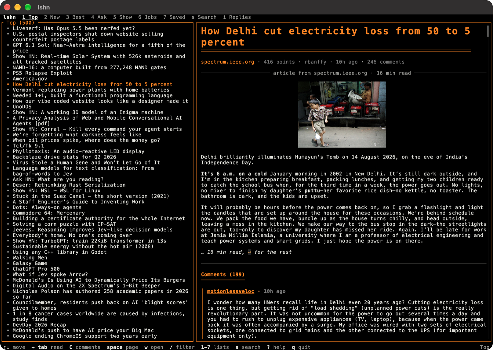
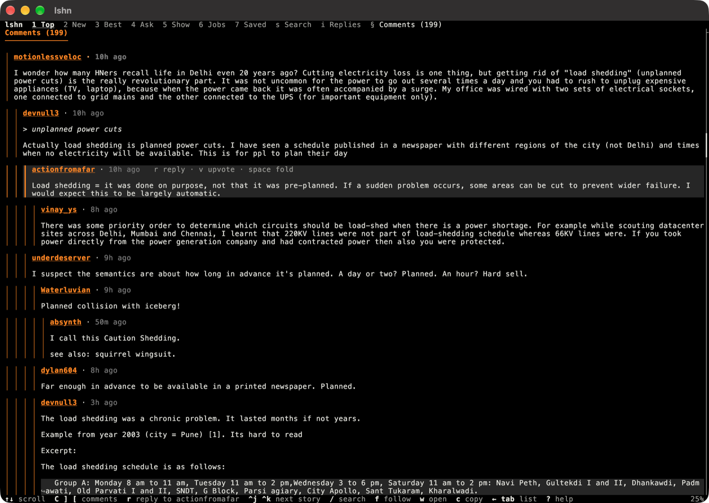
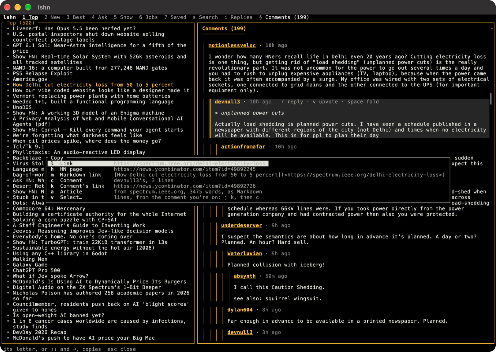

# lshn

**A terminal Hacker News reader built for speed: scan the stories, and read each one — the article and its comments — without leaving the list.**

`lshn` shows HN's front page on the left and the selected story on the right: its title, the article it links to (pulled out of the page the way a browser's reader mode does), and then its comments, threaded. Holding `↓` shows each story as fast as your keyboard repeats, because the stories around the one you're on are fetched before you get to them.



## Install

With [Homebrew](https://brew.sh), on macOS and Linux:

```sh
brew install sanford/tap/lshn
```

With Cargo, if you have a [Rust toolchain](https://rustup.rs), from [crates.io](https://crates.io/crates/lshn):

```sh
cargo install lshn
```

Or build from source:

```sh
git clone https://github.com/sanford/lshn
cd lshn
cargo build --release
./target/release/lshn
```

While hacking on it, `./run.sh [ARGS]` (or `.\run.ps1 [ARGS]` on Windows) builds, installs to `~/.local/bin`, and runs in one step.

## Usage

```sh
lshn                 # the front page
lshn best            # ...or new, best, ask, show, jobs, saved
lshn 12345           # open a story or comment: its id, or its link on HN
lshn 12345 | less -R # not a terminal: print a story, its article and comments
lshn | head          # not a terminal: list the front page (points, comments, title, link)
```

`-w 100` caps the text width. `-p` prints without colors, as does setting `NO_COLOR`. `--theme NAME` picks a color theme, and `--no-mouse` leaves the mouse to the terminal, so its own text selection works.

### Keys

In the list:

| Key | |
|---|---|
| `↑` `↓` `j` `k` | Move; with `Shift` (`⇧↑` `⇧↓` `K` `J`), a page at a time |
| `g` `G` | The first story, the last |
| `Enter` `→` `l` | Read the story full screen |
| `Tab` | Go to the story. On a terminal 130 columns or wider the list stays beside it, and `Tab` goes back and forth between them |
| `C` | Jump the preview to the comments, and back |
| `Space` `b` | Page through the preview |
| `/` | Filter the list by title; `Esc` clears it |
| `1`–`7` | Top, New, Best, Ask, Show, Jobs; and Saved, the stories you've saved, the latest first |
| `s` | Search all of HN's stories: the matches, best first, become the list. An HN link or an item's id opens it instead |
| `S` | Save the story to read later (★ in the lists), or no longer |
| `x` | Hide the story from the lists, for good (90 days, anyway); `X` shows the hidden ones, crossed out, and `x` brings one back |
| `O` | Keep the outline beside the preview, or not |
| `q` `Esc` | Quit |

Reading:

| Key | |
|---|---|
| `↑` `↓` `j` `k` | Scroll two lines (`scroll` in the settings); in the comments, go comment to comment. `J` `K`, a page |
| `Space` `b`, `d` `u`, `g` `G` | Page, half page; top, bottom. On a comment, `Space` folds it |
| `F` `E` | Fold every thread to a line; unfold everything |
| `C` | To the comments, and back to where you were |
| `]` `[` | Next and previous comment, replies included (or heading, in the article) |
| `}` `{` | Next and previous thread: top-level comments only |
| `o` | The outline: the article's headings and each top-level comment. The story follows as you move through it; `/` filters it, `Enter` goes there |
| `O` | Keep the outline open beside the story |
| `/` `n` `N` | Search the story; next and previous match |
| `f` | Follow a link: type the letters drawn on it |
| `Enter` | Beside the list, the story full screen; full screen, back to the list, where you were, with the story beside it |
| `Esc` `←` `h` `Backspace` | Back to where you followed a link from, then to the list. `←` never quits, however many times you press it |
| `Ctrl-J` `Ctrl-K` (or `Ctrl-↓` `Ctrl-↑`, `⇧↓` `⇧↑`, `>` `<`) | Next and previous story: what `↓` and `↑` do in the list |
| `\` | Keep the list on screen while reading |

Anywhere:

| Key | |
|---|---|
| `w` `W` | Open the story's link, or its HN page, in the browser |
| `c` | Copy: a menu saying just what each choice copies — the story's link, its HN page, a Markdown link to it, the comment being read or a link to it, or the article. `v` there selects lines from the keyboard: `j` `k` for more or less, then `c` |
| `v` | Upvote: in the list, the selected story; reading, the comment being read, or above the comments, the story. Again takes the vote back |
| `r` | Reply to the same, in a box over the bottom of the screen |
| `i` | Replies to you (see below) |
| `L` | Log in to HN, or out |
| `R` | Reload |
| `t` | Pick a color theme |
| `?` | All of the above |
| `Q` `Ctrl-C` | Quit, from anywhere |
| `Ctrl-Z` | Suspend, as in the shell: `fg` comes back |

`Home` `End` `PgUp` `PgDn` do what they say. Emacs keys work too: `Ctrl-N` `Ctrl-P`, `Ctrl-V` `Alt-V`, `Alt-<` `Alt->`, `Ctrl-G`, and `Ctrl-S` `Ctrl-R` to search.

So does the mouse: the wheel scrolls whatever's under it, a click selects a story (and a second click reads it), follows a link, jumps through the scrollbar, or goes to a place in the outline. Dragging over the text copies it when you let go, as plain text: without the bars beside comments, paragraphs whole however they're wrapped, and links that show an address, often cut short, as the whole address.

### Following links

Every author's name is a link: follow it (`f`, or click) for their page — karma, when they joined, what they say about themselves, and what they've posted lately, with `]` `[` going from post to post. Links to stories on HN open here too, rather than in the browser, and a story's own "comments" link goes to its comments; a link to a comment opens its story there, with the comment selected. `Esc` goes back the way you came, each page where you left it. Other links open in the browser, after you say yes (or `c` copies the address).

### Voting and replying

`v` and `r` act as you on HN, so the first time, `L` (or `v` or `r` themselves) asks you to log in. lshn keeps HN's session, never your password: in the system's keyring (Keychain on macOS, Credential Manager on Windows, the Secret Service on Linux) or, where there isn't one, in `~/.lshn/session`, encrypted with a passphrase you choose, and asked for once a run.

In the comments, `j` and `k` (or `↓` `↑`) go from comment to comment, and the page only scrolls as far as it takes to show the next one whole; one taller than the screen is read down a line at a time first. The selected comment has a band behind it and its bars in the accent color, with `r reply · v upvote · space fold` beside its author, and the footer says who `r` would answer. `Space` folds it and its replies to one line (`▸ 12 more`) and back; `F` folds every thread, `E` unfolds everything. `]` and `[` also go comment to comment, and `}` and `{` thread to thread. `v` and `r` act on the selected comment, or above the comments, on the story. A reply is written in a box over the bottom of the screen, with what you're answering still in view above it: the text wraps as you type, `Enter` starts a new line, and pasting works. `Tab` goes to its **Cancel** and **Post** buttons, and back (or click them); `Ctrl-S` posts from anywhere, and `Esc` cancels. Cancelling keeps what you wrote: `r` on the same comment carries on with it. For a long reply, `Ctrl-O` opens it in `$VISUAL` or `$EDITOR`, with what you're replying to quoted below a line, and brings it back to the box. Drafts stay in `~/.lshn/drafts/` until they're posted, so nothing is lost if HN says no. When it does — you're posting too fast, say — lshn tells you what it said, and never tries again by itself.



### Replies to you

`i` shows the replies to your latest 30 comments and stories, newest first, each with what it answers. The header says when there are new ones (`i 3 new replies`), checked when lshn starts; they're marked `new` on the page, and aren't new any more once you've seen it. As in a thread, `j` and `k` go from one to the next, and `r` and `v` reply to the one selected or upvote it; its age is a link to it in its story.

lshn knows who you are once you've logged in (it keeps your username, which is public on HN, in `~/.lshn/user`), or from `user = "you"` in the settings, for seeing your replies without logging in.

### What it remembers

Stories you've opened fade in the list, and when they've had comments since, say how many: `+12`. Open one again and its new comments are marked `new`, and the comments' heading counts them. They stay marked while you read, and aren't new any more once you move on.

What it fetches is kept in `~/.lshn/cache/` for a week, so the last lists, stories and comments show the moment it starts, and are replaced as fresh ones arrive, without losing your place. Without a connection, what's saved is still there to read. Articles are fetched once. What you've read is in `~/.lshn/seen.json`, for 90 days. Stories you've saved are in `~/.lshn/saved.json`, and those you've hidden in `~/.lshn/hidden.json`, for 90 days.

### Where it comes from

Story lists and stories come from HN's [official API](https://github.com/HackerNews/API). Each story's comments come from [Algolia's HN API](https://hn.algolia.com/api) in one request, however many there are, with the top-level comments put in HN's order. Articles are fetched from their sites and reduced to their text with [dom_smoothie](https://github.com/niklak/dom_smoothie), a port of Firefox's Readability. Pages that are really apps, videos or PDFs say so, with the address and `w` to open the website in the browser or `c` to copy it. So do pages that show their text with JavaScript, which lshn doesn't run; and a page with no article to read shows what it says about itself instead, its picture and description.

Comments follow HN's convention for quoting: a paragraph starting with `>` is shown in italics, so a reply reads as what it answers and then the answer.

An article's pictures are shown with it: the first at the top, the rest after the paragraphs they're in (the preview shows only the first). Terminals that can draw pictures (iTerm2, Kitty, WezTerm, Ghostty, and those with Sixel) show the picture itself; others, and tmux, get a rougher version drawn in colored half blocks. `images = false` turns them off.

In terminals that can draw text bigger (Kitty), each story's title is drawn at twice the size. `big-titles = false` turns that off.

Everything a story or comment says is treated as text: none of it can become formatting, or reach the terminal as a control sequence.

### Settings

`~/.lshn/config.toml`, all optional:

```toml
theme = "tokyo-night"   # hn (the default: HN's orange), amber, auto, dark, light, or one of Omarchy's themes
width = 100             # wrap text at 100 columns
feed = "best"           # the list to start with
mouse = false           # leave the mouse to the terminal
outline = true          # show the outline beside stories
scroll = 1              # lines j and k scroll (default 2)
images = false          # don't show articles' pictures
mute = ["example.com", "crypto"]  # hide stories from these sites (and their subdomains),
                                  # or with these words or phrases in their titles
big-titles = false      # titles at the text's size, even in Kitty
user = "you"            # whose replies i shows, without logging in
```

`lshn --edit-config` opens it in your editor, starting one with every setting listed, and says if what you saved can't be read. `--config FILE` reads another file instead.

`amber` is `hn` in amber, and like it, keeps your terminal's background. Here with the copy menu open over the comments:



Themes of your own go in `~/.lshn/themes/`, as `NAME.toml` or `NAME/colors.toml` in [Omarchy's](https://omarchy.org) `colors.toml` format, and are listed with the others.

`lshn --completions zsh` (or bash, fish, elvish, powershell) prints a script that completes lshn's options, and `lshn --man` its man page.
